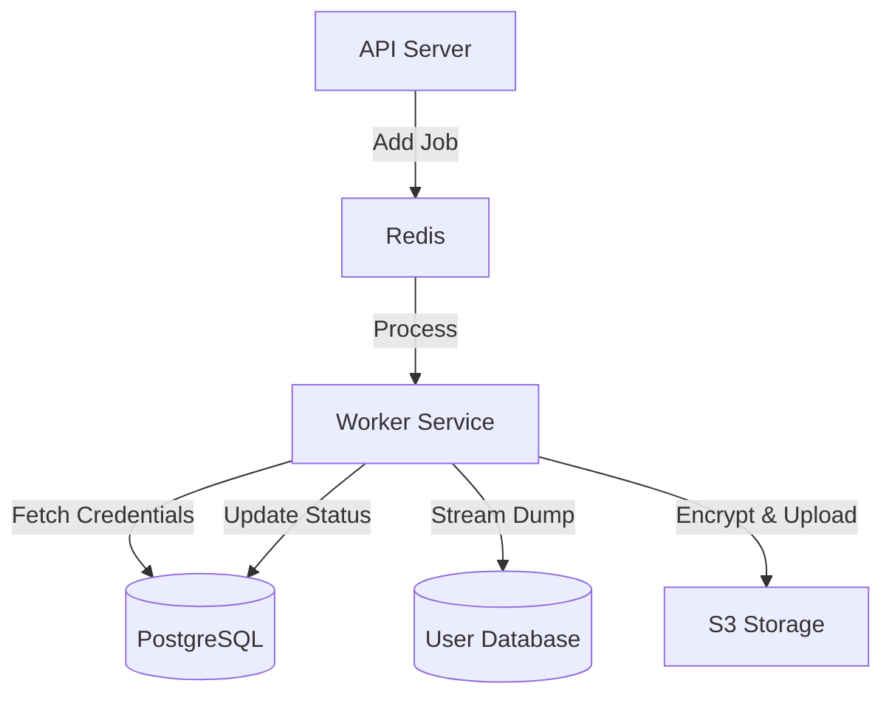

# Architecture Reference Document (ARD): DBSnap

**Version:** 1.0
**Status:** DRAFT
**Based on:** `prd_DBSnap.md`

## 1. Tech Stack & Rationale

| Component | Choice | Rationale |
| :--- | :--- | :--- |
| **Frontend** | **Next.js (App Router)** | Provides excellent SEO (marketing), server-side rendering for dashboard performance, and a robust routing system. Tailwind CSS ensures rapid UI development. |
| **Backend** | **NestJS** | Offers a structured, modular architecture suitable for scaling. Its dependency injection and strong typing (TypeScript) match the project's reliability goals. |
| **Database** | **PostgreSQL + Prisma** | Relational data integrity is critical for user/billing/project metadata. Prisma provides type-safe DB access and easy migrations. |
| **Queues** | **Redis + BullMQ** | Backup and Diff operations are long-running and resource-intensive. BullMQ handles retries, delays, and concurrency management reliably. |
| **Storage** | **S3-Compatible (MinIO/AWS)** | Scalable object storage for backups. Decouples storage from compute. |
| **Changes** | **Monaco Editor** | Best-in-class code editor for the visual diff viewer (read-only mode), familiar to developers. |

---

## 2. Detailed Data Model (Prisma Schema)

```prisma
// packages/database/schema.prisma

generator client {
  provider = "prisma-client-js"
}

datasource db {
  provider = "postgresql"
  url      = env("DATABASE_URL")
}

model User {
  id            String    @id @default(uuid())
  email         String    @unique
  passwordHash  String
  plan          UserPlan  @default(FREE)
  roleId        String
  role          Role      @relation(fields: [roleId], references: [id])
  createdAt     DateTime  @default(now())
  updatedAt     DateTime  @updatedAt
  projects      Project[]
}

enum UserPlan {
  FREE
  PRO
  TEAM
}

  TEAM
}

model Role {
  id          String       @id @default(uuid())
  name        String       @unique // ROOT, ADMIN, CUSTOMER_DEVELOPER, CUSTOM_XXX
  permissions Permission[]
  users       User[]
}

model Permission {
  id        String   @id @default(uuid())
  action    String   // e.g. "backup:create", "db:read"
  roles     Role[]
}

model Project {
  id          String     @id @default(uuid())
  name        String
  environment Environment @default(DEV)
  userId      String
  user        User       @relation(fields: [userId], references: [id])
  databases   Database[]
  createdAt   DateTime   @default(now())
  updatedAt   DateTime   @updatedAt
}

enum Environment {
  DEV
  STAGING
  PROD
}

model Database {
  id                  String   @id @default(uuid())
  type                DbType
  connectionStringEnc String   // AES-256 encrypted
  iv                  String   // Initialization Vector
  projectId           String
  project             Project  @relation(fields: [projectId], references: [id])
  backups             Backup[]
  createdAt           DateTime @default(now())
}

enum DbType {
  MONGODB
  POSTGRESQL
}

model Backup {
  id          String       @id @default(uuid())
  databaseId  String
  database    Database     @relation(fields: [databaseId], references: [id])
  storageKey  String       // S3 Key
  sizeBytes   BigInt
  status      BackupStatus
  metadata    Json?        // e.g. collection names, row counts
  startedAt   DateTime     @default(now())
  completedAt DateTime?
  
  // Relations for Diffs
  sourceDiffs Diff[] @relation("SourceBackup")
  targetDiffs Diff[] @relation("TargetBackup")

  @@index([databaseId, startedAt(sort: Desc)]) // Fast history lookup
}

enum BackupStatus {
  PENDING
  PROCESSING
  COMPLETED
  FAILED
}

model Diff {
  id             String     @id @default(uuid())
  sourceBackupId String
  targetBackupId String
  sourceBackup   Backup     @relation("SourceBackup", fields: [sourceBackupId], references: [id])
  targetBackup   Backup     @relation("TargetBackup", fields: [targetBackupId], references: [id])
  summary        Json       // Compressed diff summary (collections changed, tables changed)
  detailsUrl     String?    // Path to full diff detail JSON in S3 if too large
  createdAt      DateTime   @default(now())
}
```

---

## 3. Worker & Queue Architecture

We utilize **BullMQ** to isolate heavy lifting from the API server.

### 3.1 Queues

| Queue Name | Job Name | Action | Strategy |
| :--- | :--- | :--- | :--- |
| `backup-queue` | `performConnectAndDump` | Connects, streams dump, encrypts, uploads. | **Retries:** 3 (Exponential Backoff). **Concurrency:** Limited per user/plan. |
| `diff-queue` | `computeDiff` | Downloads 2 snapshots, streams compare, saving summary. | **Retries:** 0 (Deterministic failures likely). **Priority:** Lower than backups. |
| `restore-queue` | `performRestore` | Downloads, decrypts, restores to target DB. | **Retries:** 0 (High Risk: Manual restart preferred). |

### 3.2 Diagram



---

## 4. Security & Encryption Flow

All sensitive data (Connection Strings, Backups) uses **AES-256-GCM** authenticated encryption.

### 4.1 Key Management
*   **Master Key (MK):** Injected via environment variable `ENCRYPTION_KEY` (from KMS/Secret Manager).
*   **Data Encryption Key (DEK):** Generated per file/record (optional advanced flow) or we use MK + unique IV per record.

### 4.2 Credential Storage
1.  User enters Connection URI.
2.  API generates random IV (16 bytes).
3.  `Cipher = AES_Encrypt(URI, MK, IV)`
4.  Store `Cipher` and `IV` in `Database` table.

### 4.3 Backup Encryption (Streaming)
We never store unencrypted backups on disk.
1.  **Read Stream** from Database (e.g., `pg_dump` or `mongodump`).
2.  **Pipe** through `crypto.createCipheriv`.
3.  **Pipe** to S3 Upload Stream.
*Result:* Data is encrypted before it leaves the worker's ephemeral memory context.

---

## 5. The Diff Engine Spec

To support large datasets without OOM (Out Of Memory) errors, we strictly use **Streaming & Merkle/Hash Comparisons**.

### 5.1 MongoDB (Collection-Level)
*   **Concept:** Merkle Tree Hashing.
*   **Process:**
    1.  Stream documents from Backup A and Backup B (if standard BSON dump, restore to temp or parse BSON stream).
    2.  As we parse, bucket documents (e.g., blocks of 1000).
    3.  Compute Hash of each bucket.
    4.  Compare Hash(Bucket A) vs Hash(Bucket B).
    5.  **Match?** Skip.
    6.  **Mismatch?** Loading documents into memory and compute JSON Patch (Map-Reduce).

### 5.2 SQL (Table-Level)
*   **Concept:** Ordered Stream Comparison (PK-based).
*   **Assumption:** Tables must have a Primary Key (PK).
*   **Process:**
    1.  Ensure dumps are **ordered by PK**.
    2.  Open Stream A and Stream B.
    3.  Read Row A and Row B.
    4.  **Loop:**
        *   If `A.id == B.id`:
            *   Compare `Hash(A.data)` vs `Hash(B.data)`. Mismatch = **MODIFIED**.
            *   Advance A and B.
        *   If `A.id < B.id`:
            *   Row A exists but not B (since streams are sorted). Row A = **DELETED**.
            *   Advance A.
        *   If `A.id > B.id`:
            *   Row B exists but not A. Row B = **CREATED**.
            *   Advance B.
*   **Memory Footprint:** Constant (O(1)), only holds 2 rows in memory.

---

## 6. Project Structure (Monorepo)

Using **Turborepo** for build caching and orchestration.

```
/
├── apps/
│   ├── web/            # Next.js Frontend
│   ├── api/            # NestJS API Server
│   └── worker/         # NestJS Queue Worker (Consumer)
├── packages/
│   ├── database/       # Prisma Schema & Client
│   ├── ui/             # Shared React Components (Tailwind)
│   ├── config/         # Shared Typescript/Eslint configs
│   ├── shared-types/   # DTOs, Enums shared between FE/BE
│   └── crypto-utils/   # Encryption/Decryption helpers
└── docker-compose.yml  # Dev infrastructure
```

---

## 7. Implementation Roadmap

### Phase 1: Foundation (Days 1-3)
- [ ] Set up Monorepo (Turbo, Nest, Next).
- [ ] Configure Docker Compose (Postgres, Redis, MinIO).
- [ ] Implement `packages/database` and User Auth (JWT).

### Phase 2: Core Backup Engine (Days 4-10)
- [ ] Create `apps/worker` and BullMQ setup.
- [ ] Implement `crypto-utils` (Encryption wrappers).
- [ ] Build **Mongo Connector**: Uses `mongodump` stream -> S3.
- [ ] Build **Postgres Connector**: Uses `pg_dump` stream -> S3.
- [ ] API: "Trigger Backup" endpoint.

### Phase 3: The Diff Engine (Days 11-20)
- [ ] Implement **S3 Stream Reader**.
- [ ] Build **SQL Diff Streaming Logic** (PK Sort comparison).
- [ ] Build **Mongo Diff Logic** (Bucket Hashing).
- [ ] Store results in `Diff` table.

### Phase 4: UI Construction (Days 21-25)
- [ ] Monaco Editor integration for diff view.
- [ ] Dashboard: Project List, Backup History Timeline.
- [ ] Connect FE to BE API.
- [ ] **Admin Panel**: User Management, Project Oversight, System Health Dashboard.

### Phase 5: Verification & Polish (Days 26-30)
- [ ] Load Testing (1GB+ database dumps).
- [ ] Verify Encryption (Inspect S3 files manually to ensure garbage).
- [ ] Deployment Scripts (Docker/K8s).
