# DBSnap Project Implementation Roadmap

This document visualizes the 30-day implementation plan defined in the [Architecture Reference Document](./ard_DBSnap.md) and [Master Task List](../TODO.md).

```mermaid
gantt
    title DBSnap Development Roadmap (30 Days)
    dateFormat  X
    axisFormat Day %X

    section Phase 1: Foundation
    Repo Setup & Monorepo       :done, p1_1, 0, 1
    Docker Dev Env              :active, p1_2, 1, 2
    DB & Auth Implementation    :p1_3, 2, 3

    section Phase 2: Core Backup
    Worker & Queue Setup        :p2_1, 4, 5
    Crypto Utils (AES-256)      :p2_2, 5, 6
    DB Handlers (Mongo/PG)      :p2_3, 6, 9
    Backup API & Cron           :p2_4, 9, 10

    section Phase 3: Diff Engine
    S3 Stream & Utils           :p3_1, 11, 12
    SQL Diff (Ordered Stream)   :p3_2, 12, 15
    Mongo Diff (Merkle Hash)    :p3_3, 15, 18
    Diff API & Persistence      :p3_4, 18, 20

    section Phase 4: UI/Admin
    Dashboard & Projects        :p4_1, 21, 22
    Monaco Diff Viewer          :p4_2, 22, 23
    Connections & Settings      :p4_3, 23, 24
    Admin Panel                 :p4_4, 24, 25

    section Phase 5: Verification
    Load Testing (10GB+)        :p5_1, 26, 27
    Security/Encryption Audit   :p5_2, 27, 28
    Deployment & Docs           :p5_3, 28, 30
```

## Phase Deliverables

| Phase | Milestone | Key Deliverable |
| :--- | :--- | :--- |
| **1** | **Foundation** | Working Monorepo, Local Dev, User Auth |
| **2** | **Backup Core** | Encrypted backups streaming to S3 from Mongo/Postgres |
| **3** | **Diff Engine** | Ability to detect changes between two encrypted snapshots |
| **4** | **UI Construction** | Functional Dashboard, Diff Viewer, and Admin Panel |
| **5** | **Launch Ready** | Verified security, load-tested streaming, CI/CD pipeline |
